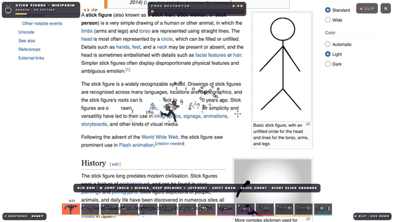

# Wreck the Web



[](https://github.com/ayomidealaka/wreck-the-web/stargazers)
[](https://github.com/ayomidealaka/wreck-the-web/releases)
[](LICENSE)

Type in a website and it becomes a level. Run across the page, shoot the words off it, blow holes through the
pictures and knock whole sections loose until the thing comes apart.

If it made you laugh, [give it a star](https://github.com/ayomidealaka/wreck-the-web) so more people find it. What
changed in each version is in the [changelog](CHANGELOG.md).

```bash
npm install
npm start            # http://localhost:4600   (PORT=xxxx to change)
```

It listens on this machine only; `HOST=0.0.0.0 npm start` opens it to your network (to try it on a phone, say).
Needs Node 20+ and Google Chrome (set `CHROME_PATH` if it isn't where the server looks). Any level can be shared
as a link: `http://localhost:4600/?url=wikipedia.org`.

## Controls

| Desktop | Touch |
|---|---|
| A / D run, S drop through a ledge | Left stick (down to drop) |
| W or Space: tap to hop, hold to go higher, keep holding for the jetpack; press again in the air to flip | Push the stick up, or ▲ |
| Shift, or double-tap a direction: dash (one in the air) | ⟫ |
| Mouse aims, click shoots | Right stick aims and fires |
| Right click or G: grenade. With the gravity well, right-click holds debris and release throws it | ● |
| `[` airstrike | ✈ |
| 1–0, `-`, `=`, `,`, `.` or the wheel: switch weapon | ⇄ |
| R save a replay clip, Esc pause, M mute | Clip and ⏸ buttons |

**Weapons:** Uzi, AK‑47, minigun, shotgun, .50 sniper, 40mm launcher, rocket launcher, flamethrower, laser,
gravity well, gatling drone, mini nuke, cluster launcher and pulsar. Each has its own reticle, recoil
and sound. Rounds fly as far as the cursor and punch paper holes where they land; the sniper's round carves a trench
and ricochets off images; the rail laser charges for a moment, then fires one beam to the edge of the page that cuts
a trench through everything on the way, flinging the letters it passes and leaving the edges glowing; rockets and the nuke
go off at the aim point. The gravity well lands as a vortex whose two arms sweep round it tearing the page out, then
collapses into a crater with radial cracks. The cluster shell drifts down under a parachute and splits into eight bomblets. The pulsar
forms a star whose two jets sweep a widening disc out of the page before it collapses and bursts into a crater with
radial cracks. Every blast leaves a ring of fire round its crater, and the flamethrower sets the page itself alight:
fire spreads across it, chars it and burns it away.

**Characters:** Ash, Raven, Doc, Kane and Jett, picked on the menu. They're rigged characters whose arms, legs and
heads are posed every frame: proper run and jump cycles, hands solved onto each weapon's grips, recoil springs, a
weapon swing-in, a shotgun pump and a grenade throw. They share one art style, with its own art for every weapon, the
jetpack, the drone and the airstrike. (The original classic pixel cast is still in `public/art/` but switched off.)

## Progress

No sign-up: the game gives you an anonymous id and a random name ("Wobbly Navbar", change it on the menu) and keeps
everything in your browser. You earn XP for knocking letters off (one per ten), smashing things (five each),
destroying a website (150) and finishing the daily challenges. XP buys twelve ranks, each with its own pixel-art medal,
from Lurker to Web Wrecker; a new rank pops up in the game as you reach it. Three daily challenges, an easy, a medium
and a hard one, are the same for everyone on a given day and are about destroying websites and the guns you use
("Knock 300 letters off with the Uzi", "Destroy a website using only the Rocket Launcher", "Destroy a website in under
4 minutes"). They change at midnight.

## How it works

**Server** (`server/`). `snapshot.js` opens the site in headless Chrome, waits for its scripts, scrolls to wake
lazy images, flattens sticky and fixed overlays, then records a full-page WebP at the player's window size and
pixel density plus the box of every letter, image and styled block. Phones get the site's mobile layout. The browser
running the game never touches the target site.

**Level** (`public/js/level.js`). The screenshot is cut into tiles that live on the GPU and are drawn and carved but
never read back. A copy of the untouched page stays in main memory for the things that need pixels: letters are cut
out of it when they pop, and a colour table (one colour per 4px block) colours debris and dust. The boxes become a 2px
grid: letters, images and controls are content you can stand on and shoot; styled boxes are ledges; backgrounds let
shots through. Behind the page sits a pixel-art scene in parallax layers, seen through the holes: a synthwave city,
mountains at dusk, sunny hills or deep space, one per site and never the same one twice running (`?bg=synth`
forces one).

**Breaking things.** Letters go in one hit and fly off as their own cut-outs. Images, buttons and other elements have
hit points that grow with their size; bullets carve a short tunnel into them, they crack at 30/55/80% and come loose
as one falling slab once their hit points run out or 38% of them has been carved away. Cards and sections work the
same way and take their contents with them when they fall. A slab that is shot while falling shatters. The page
counts as destroyed once 70% of its letters and 70% of its content are gone; the results float over the page and
you can keep going.

**Feel.** Fixed 60Hz steps, tiered screen shake, hot rims that cool on fresh holes, soft scorch round blasts, lighter
effects on machines that can't keep up, and a replay buffer: two staggered `MediaRecorder`s keep the last 20–40s
ready and R saves it as MP4 (or WebM) with sound.

## Layout

```
server/              the page snapshotter and the static server
public/              the game: index.html, style.css, js/
public/art/          sprites, Ash (packs/test/, listed in packs.json) and the switched-off classic cast (cast.json)
scripts/art/         the art pipeline: PixelLab generation, skeleton estimation, rig cutting
scripts/playtests/   headless playtests, visual checks and profilers
deploy/              Dockerfile and Kubernetes manifests (see deploy/README.md)
```

## Safety

The server opens arbitrary websites in a real browser, so for the page and every request it makes it refuses
private, loopback, link-local and reserved addresses (IPv4 hidden in IPv6 included) and anything off ports 80 and
443, keeps Chrome's popup blocker on, denies downloads, strips credentials, rate-limits renders per client, caps the
queue and gives every render 45 seconds. Errors from Chrome aren't passed on to players.

An address check can't stop DNS rebinding, so don't expose it to the internet without a network-level block as well.
`deploy/` has a Kubernetes network policy that lets the pod reach only public addresses on 80 and 443.

## Deploying your own

`deploy/` has a Dockerfile (the server plus Chromium and fonts), Kubernetes manifests (a locked-down deployment, a
service, an ingress with cert-manager TLS and the network policy that keeps the renderer on the public web) and
`deploy/deploy.sh`, which builds, tests, pushes and rolls it out. You build the image into your own registry;
[deploy/README.md](deploy/README.md) walks through it, including running it with plain Docker.

## Privacy

The public site at wreck-the-web.retrodeep.app uses self-hosted [Umami](https://umami.is) analytics: cookieless, no
consent banner, and nothing that identifies a player, just visits and game events (site wrecked, character, weapons,
time). Your own copy sends nothing anywhere unless you configure a tracker (see `deploy/README.md`).

## Testing

Everything under `scripts/playtests/` drives the game in headless Chrome against a running server and prints what it
measured, usually with screenshots in the directory you give it:

```bash
node scripts/playtests/playtest-weapons.mjs out/        # every weapon fired, a screenshot of each, errors listed
node scripts/playtests/playtest-elements.mjs out/       # an image takes the expected number of shots to break
node scripts/playtests/playtest-nesting.mjs out/        # a card falls whole after enough wear
node scripts/playtests/playtest-sites.mjs out/ bbc.com  # the feel pass on a real site, with frame times
node scripts/playtests/playtest-mobile.mjs out/         # phone-sized touch run
node scripts/playtests/check-blast.mjs out/             # rockets at the cursor, the trench, scorch, jetpack
node scripts/playtests/profile-nuke.mjs                 # frame times and hot functions around a nuke
```

## Art pipeline

The sprites were generated with [PixelLab](https://www.pixellab.ai) and cut up by the scripts in `scripts/art/`,
which read the API key from `.env` (see `.env.example`). The reference sprite sheets used to measure the run and
jump cycles are not part of the repository.

New characters in Ash's style are made from his own drawing, so they match him and rig the same way. Describe the
character in `scripts/art/characters.json`, then:

```bash
node scripts/art/gen-char.mjs <id> reference 1 2        # Ash's drawing edited into the character (a few seeds)
node scripts/art/rig-char.mjs pose <id> base_reference_1.png   # the one you like: skeleton, then A-poses
node scripts/art/rig-char.mjs cut <id> 0                 # A-pose 0 cut into rig parts
```

then add it to `public/art/packs/test/cast.json`, with a `height` that keeps Ash's pixel scale, and check it with
`node scripts/playtests/check-rig.mjs out.png test <id>`. The reference images guiding each look (in
`public/art/ref/chars/`) aren't in the repository; `gen-char.mjs text` works from the description alone.

## Contributing

Bug reports and ideas are welcome in [issues](https://github.com/ayomidealaka/wreck-the-web/issues). For a pull
request, run the playtests that touch your change and say what you checked.

## License

[MIT](LICENSE).
